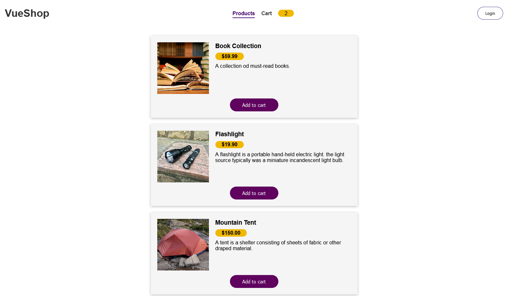

<h1 >
    Vue-Shop
</h1>

<div align="center">
     
</div>

<p align="center" target="_blank">
    Made with 💜 by Vinicius Jose
</p>


# Technology
<p>
    This project was developed with the following technologies:
</p>

- Vue
- Vue-router
- Vuex

# Description
This small application (example-vue-shop) was built using vue, vuex and vue-router. I built the following pages within the application: product list, the user's shopping cart, where you can remove and add products, I used component transition for fluid component changes.

# How To Use
To clone and run this application

```bash
    # Clone this repository
    $ git clone https://github.com/lukemorales/react-rocketshoes

    # Go into the repository
    $ cd example-vue-shop

    # Install dependencies
    $ npm install

    # Run the app
    $ npm start

```

---

<h4 align="center"> <em>&lt;/&gt;</em> by <a href="https://github.com/zV1N1" target="_blank">zV1N1</a> </h4>